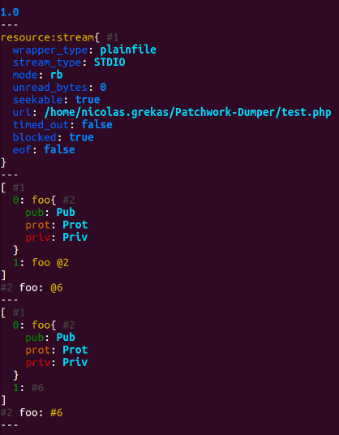

High accuracy and flexible dumping for PHP variables
====================================================

This package provides a better `dump()` function, that you can use instead of
`var_dump()`, *better* being for:

- ablilty to dump internal references, either soft ones (objects or resources)
  or hard ones (`=&` on arrays or objects properties). Repeated occurences of
  the same object/array/resource won't appear again and again anymore. Moreover,
  you'll be able to inspected the reference structure of your data.
- per object and resource types specialized view: e.g. filter out Doctrine noise
  while dumping a single proxy entity, or get more insight on opened files with
  `stream_get_meta_data()`. Add your own dedicated `Dumper\Caster` and get the
  view *you* need.
- configurable output format: command line with colors or [a dedicated high
  accuracy JSON format](https://github.com/nicolas-grekas/Patchwork-Doc/blob/master/Dumping-PHP-Data-en.md).
  More to come / add your own.
- full exposure of the internal mechanisms used for walking through an arbitrary
  PHP data structure.

Usage
-----

The recommended way to use Patchwork Dumper is [through composer](http://getcomposer.org).
Just create a `composer.json` file and run the `php composer.phar install`
command to install it:

    {
        "require": {
            "patchwork/dumper": "1.0.*"
        }
    }

Then, early in your bootstrap sequence, enable e.g. CLI output with colors:

```php
set_dump_handler(function ($var) {\Patchwork\Dumper\CliDumper::dump($var);});
```

Then enjoy debugging with `dump($var)`.

More advanced usages are possible. Please check the source code or open issues on
GitHub to get *how-to* answers.

Example
-------

```php
<?php

require __DIR__ . '/vendor/autoload.php';
set_dump_handler(function ($var) {Patchwork\Dumper\CliDumper::dump($var); echo "---\n";});

$var = 1.0;
dump($var);

$var = fopen(__FILE__, 'rb');
dump($var);

class foo
{
    public $pub = 'Pub';
    protected $prot = 'Prot';
    private $priv = 'Priv';
}

$foo = new foo;
$var = array($foo, $foo);
dump($var);

$var = array($foo);
$var[1] =& $var[0];
dump($var);
```



License
-------

Patchwork\Dumper is free software; you can redistribute it and/or modify it under
the terms of the (at your option):
- [Apache License v2.0](http://apache.org/licenses/LICENSE-2.0.txt), or
- [GNU General Public License v2.0](http://gnu.org/licenses/gpl-2.0.txt).

This code is extracted from the [Patchwork](http://pa.tchwork.com/) framework
where it serves as the foundation for the debugging system. It is released here
standalone in the hope that it can be used in a different context successfully!
