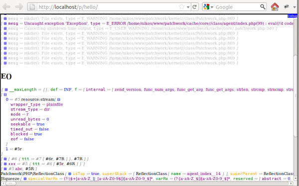

==================================================================
Convention pour représenter avec fidélité une variable PHP en JSON
==================================================================

Nicolas Grekas - nicolas.grekas, gmail.com  
4 octobre 2011 - Dernière mise à jour le 24 février 2014

[Version française](json-spec-fr.md) - [English version](json-spec-en.md)

Introduction
============

`print_r()`, `var_dump()`, `var_export()`, `json_encode()`, `serialize()`.
Toutes ces fonctions permettent de représenter une variable PHP sous forme de
chaîne de caractères, chacune permettant d'obtenir une représentation adaptée au
besoin du moment :

* être lisible par un humain,
* être lisible par un programme,
* être fidèle dans le cas des variables complexes (récursives, objets ou
  ressources par ex.).

Pour les besoins d'un débogage, la représentation préférée doit évidement
être lisible par un humain et rester la plus fidèle possible.

Pendant le développement, il est courant en PHP d'afficher les erreurs et les
variables intermédiaires au beau milieu de la page sur laquelle on travaille.
Pourtant, cette pratique n'est pas recommandée, car elle peut casser le flux de
sortie de l'application. Dans le cas des pages HTML simples, c'est généralement
acceptable, mais dès que les pages deviennent plus complexes, que PHP est
utilisé pour générer d'autres contenus (JavaScript, PDF, ZIP, etc.), cette
méthode n'est plus adaptée.

Si l'humain est toujours le lecteur final, un système de debug performant a
donc besoin d'une représentation intermédiaire pour transmettre l'état d'une
variable au système qui l'affichera dans une fenêtre dédiée.

Les types de variables PHP
==========================

Les variables en PHP peuvent prendre de nombreux types différents, qu'il faut
tous prendre en compte pour représenter avec fidélité n'importe quelle variable.

Scalaires
---------

Les scalaires rassemblent les nombres entiers, les nombres à virgule flottante,
les constantes spéciales `true`, `false`, `null`, `NAN`, `INF` et `-INF`, et
bien sûr les chaînes de caractères.

Les chaînes de caractères en PHP sont de simples séquences d'octets qui peuvent
contenir des informations éventuellement binaires, même si UTF-8 est très
souvent utilisé de nos jours pour représenter du texte.

Tableaux
--------

Les tableaux PHP sont en réalité des tables de hachages ordonnées. Ils acceptent
n'importe quelle chaîne de caractères ou entier numérique en guise de clef.
PHP ne fait pas la différence entre une clef entière numérique et sa
représentation en base 10 sous forme de chaîne de caractères.

Objets
------

Les objets utilisent la même structure de table de hashage ordonnée que les
tableaux à une exception près : le nom d'une propriété d'objet ne peut pas
commencer par le caractère NUL ("\x00"). Chaque objet possède également une
classe principale ainsi que des propriétés associées à une visibilité publique,
protégée ou privée.

Contrairement aux scalaires et tableaux, les objets sont passés « par référence »
(voir le [manuel PHP](http://php.net/language.oop5.references.php) pour plus de
précisions).

Ressources
----------

Les ressource en PHP ont un type retourné par `get_resource_type()`. Certains
types possèdent des propriétés internes qu'il est possible de consulter
avec des fonctions adéquates. Par exemple, il est possible d'obtenir plus
d'informations sur les ressources de type `stream` en appelant la fonction
`stream_get_meta_data()`, de même avec `proc_get_status()` pour les ressources
de type `process`. Les ressources possèdent également un identifiant interne
auquel on accède en les transformant en chaîne de caractères.
Par exemple : `echo (string) opendir('.');` va afficher `Resource id #2`, où
`2` est l'identifiant interne de la ressource renvoyée par `opendir()`.

Les ressources sont donc très similaires aux objets PHP : comme eux, elles sont
passées « par référence », possèdent un type et des propriétés.

Attention : dans le cas général, la fonction `is_resource()` n'est pas fiable
pour détecter les variables de type `resource`.
Voir [ce commentaire](http://php.net/is_resource#103942) dans la doc PHP.

Références
----------

PHP possède deux mécanismes de gestion de références :

* l'un permet de lier deux variables entre elles pour les rendre alias l'une de
  l'autre, comme dans `$b =& $a;` par exemple,
* l'autre est utilisé pour la transmission des objets et des ressources.

Les références par alias permettent de créer des structures récursives infinies,
comme par exemple dans `$a = array(); $a[0] =& $a;`.

Elles permettent également de créer des alias internes à des positions qui ne
créent pas nécessairement de récursivité, comme par exemple dans ce code où
$b[0] et $b[1] sont liés par référence : `$a = 123; $b = array(&$a, &$a);`.

Les références utilisées pour la transmission des objets/ressources permettent
de mettre le même objet/ressource en plusieurs endroits d'une structure
arborescente.

La représentation recherchée se doit de refléter la présence de ces deux types
de références, sans quoi il serait impossible de représenter une structure
récursive sans tomber dans le piège de la récursivité infinie. D'autre part
cela permet l'examen des liens internes d'une structure arborescente.

Recherche de la représentation idéale
=====================================

La représentation intermédiaire d'une variable à déboguer doit :

* être aussi fidèle que possible pour permettre un débogage efficace,
* être interopérable, en particulier avec le programme en charge de la
  représenter visuellement,
* si possible rester lisible par un humain, pour faciliter le débogage du
  système de débogage lui-même.

Par ailleurs, le code qui génère cette représentation intermédiaire doit être
aussi neutre que possible du point de vue de l'application dans laquelle il
s'exécute :

* il doit pouvoir être opérant quel que soit le contexte d'exécution et la
  variable à représenter,
* il doit être rapide et avoir une emprunte mémoire minimale.

Analyse des fonctions existantes
--------------------------------

Sur le seul critère d'être opérant quel que soit le contexte d'exécution, seule
`json_encode` n'est pas disqualifiée :

* `print_r` et jusqu'à PHP 5.3.3 `var_export` génèrent une erreur fatale
  lorsqu'elles sont utilisées dans le contexte d'un gestionnaire de flux de
  sortie,
* `var_dump` ne fonctionne pas dans le contexte d'un gestionnaire de flux de
  sortie,
* `serialize` ne fonctionne pas avec certains objets natifs ou autres qui
  génèrent une exception lorsqu'ils sont sérialisés.

Sur le plan de l'interopérabilité :

* les sorties de `print_r` et `var_dump` sont prévues pour être lues par un
  humain, pas particulièrement par un programme,
* `var_export` génère une représentation sous forme de code PHP, ce qui reste
  lisible pour un humain mais n'est facilement lu que par PHP lui-même,
* la sortie de `serialize` est prévue pour être lue par la fonction
  `unserialize` native à PHP, quasiment illisible pour un humain,
* `json_encode` génère une sortie interopérable, éventuellement lisible par un
  humain, même si les caractères encodés gênent la lecture.

Sur le plan de la rapidité et de l'emprunte mémoire, toutes ces fonctions
sont équivalentes.

Sur les autres critères :

* pour les structures récursives comportant des références internes,
  `serialize` les gère parfaitement, `var_export` génère une erreur fatale,
  `var_dump` et `print_r` affichent un laconique `*RECURSION*`, `json_encode`
  émet un warning et place un `null` à la place de chaque référence récursive,
* pour les variables de type `resource`, seule `var_dump` et `print_r` donnent
  une information utile,
* `json_encode` ne gère que les chaînes de caractères encodées en UTF-8, là où
  les chaînes PHP n'ont pas d'encodage particulier et peuvent même être
  binaires,
* Xdebug améliore significativement `var_dump` mais n'apporte de solution ni
  pour les gestionnaires de flux de sortie ni pour l'interopérabilité.

Ainsi, aucune fonction native ne combine les qualités fondamentales recherchées.

Convention JSON détaillée
=========================

Pour le critère de lisibilité et surtout d'interopérabilité, le format JSON
semble le plus adapté.

Sans autre convention, JSON ne suffit pas nativement à représenter toute
l'étendue des valeurs que peut prendre une variable PHP.

Pour contrôler la performance et l'emprunte mémoire, il est souhaitable
également de pouvoir restreindre l'exhaustivité de la représentation, en
limitant par exemple les tableaux à leurs premiers éléments, les chaînes de
caractères à leurs premiers octets et les structures arborescentes à un niveau
de profondeur maximal.

La représentation décrite dans la suite établit des conventions qui permettent
d'utiliser JSON pour décrire toutes ces possibilités. Elle est conçue à la fois
pour permettre la plus grande fidélité possible à n'importe quelle variable PHP,
mais également pour rester aussi proche que possible d'un JSON natif, facilitant
d'autant l'exploitation ou la lecture du résultat brut par un programme ou un
humain.

Chaînes de caractères
---------------------

JSON ne permet de représenter que des chaînes de caractères UTF-8. Une
chaîne de caractères PHP arbitraire est préparée ainsi :

Si la chaîne ``$str`` considérée n'est pas valide en UTF-8, alors elle est
transformée en UTF-8 grâce à ``"b`". utf8_encode($str)``. Toute chaîne de
caractères déjà valide en UTF-8 est conservée identique à elle-même, sauf si
elle contient un backtick, auquel cas elle est préfixée par `` u` ``. Si une
limite de longueur est applicable, la chaîne de caractères est tronquée selon
cette limite. La longueur initiale décomptée en nombre de caractères UTF-8 est
alors préfixée à la chaîne. Le prefix `` u` `` est dans ce cas obligatoire même
si la chaîne d'origine ne contient pas de backtick. Ensuite la chaîne de
caractères résultante est encodée en JSON natif.

Par exemple : `"\xA9"` devient ``"b`©"``, ``"a`b"`` devient ``"u`a`b"`` et
`"©"` reste sous cette forme. La chaîne UTF-8 de longueur quatre ``"déjà"``
tronquée à deux caractères est représentée sous la forme ``"4u`dé"``. La chaîne
de caractères vide est toujours représentée ainsi `""`.

Cette convention de représentation laisse de la place pour d'autres préfix
que `` b` `` ou `` u` ``. Ainsi les préfix `` r` ``, `` R` ``, `` n` `` sont
utilisés pour représenter des valeurs spéciales (cf. suite).

Nombres et autres scalaires
---------------------------

Les nombres entiers, flottants ou les valeurs `true`, `false` et `null` sont
représentés nativement en JSON.

Les entiers et flottants étant sujets à dépassement ou limite de précision,
ils peuvent également être représentés sous forme de chaîne de caractère
préfixée par `` n` ``. Ceci est nécessaire pour les entiers supérieurs à
2^53, qui est la limite supérieure pour les entiers JavaScript.
Sur les systèmes 64-bit par exemple, `PHP_INT_MAX` est représenté par
``"n`9223372036854775807"``.

Les constantes spéciales `NAN`, `INF` et `-INF` sont représentées par des
chaînes de caractères JSON, respectivement :
``"n`NAN"``, ``"n`INF"`` et ``"n`-INF"``.

Dans le contexte des clefs d'une structure associative cependant, JSON n'accèpte
que des chaînes de caractères. Les clefs numériques des tableaux PHP sont donc
représentées sous la forme de chaînes de caractères JSON. Comme PHP ne fait
aucune distinction entre les clefs numériques représentées sous forme de chaîne
de caractères ou d'entier, ceci n'impacte pas la fidélité de la représentation.

Structures associatives : tableaux, objets et ressources
--------------------------------------------------------

Les tableaux vides sont représentés sous la forme JSON ``[]``.
C'est le seul cas qui utilise la syntaxe des tableaux JSON natifs.

Les tableaux PHP, objets et ressources sont représentés par la syntaxe objet de
JSON, selon les règles suivantes :

* les clefs `"_"`, `"__cutBy"`, `"__refs"` et `"__proto__"` sont réservées,
* les clefs correspondant à des propriétés protégées d'objets sont préfixées
  par `*:`
* les clefs correspondant à des propriétés privées d'objets sont préfixées par
  le nom de la classe qui leur est associée suivie d'un `:`,
* les clefs clefs correspondant à des propriétés publiques d'objets sont
  préfixées par un `:` lorsqu'elles entrent en collision avec une clef réservée
  ou qu'elles contiennent un `:`,
* les clefs correspondant à des méta-données sont préfixées par `~:`. N'importe
  quelle méta-donnée peut-être associée à un objet pour faciliter sa
  compréhension : propriété statique, état spécial géré par une classe interne
  (les lignes de début et de fin d'une closure par ex.), etc.

Les clefs réservées ont une sémantique définie ainsi :

* `"_"` contient le numéro d'ordre dans la structure associative générale
  représentée, suivie d'un `:`, puis :
  * pour les objets du nom de leur classe,
  * pour les tableaux du mot-clef `array` suivi d'un `:` puis de leur longueur
    retournée par `count($tableau)`,
  * pour les ressources du mot-clef `resource` suivi d'un `:` puis de leur type
    retourné par `get_resource_type($resource)`,
* `"__cutBy"` contient le nombre d'éléments tronqués dans la structure locale
  en application d'une limite de profondeur ou de nombre par exemple,
* `"__refs"` contient une table des références internes de la structure
  générale représentée (cf. suite), elle ne devrait donc être présente qu'au
  niveau de profondeur le plus bas, en dernière position,
* `"__proto__"` n'a pas de sémantique particulière mais est réservé pour
  assurer la compatibilité du JSON produit avec certains navigateurs.

Références internes
-------------------

À l'intérieur des structures arborescentes, on identifie chaque position au
moyen d'un numéro correspondant à son ordre de découverte dans la structure,
selon un algorithme de parcours en profondeur tenant compte des éventuelles
références internes.

Lorsqu'une référence à une position précédente est rencontrée, il est possible
d'éviter de représenter une seconde fois la valeur de la position courante en
insérant la chaîne ``"R`"`` si les deux positions sont alias l'une de l'autre,
et ``"r`"`` si les deux contiennent un même objet ou une même ressource. La
substitution par ``"R`"`` n'est obligatoire que dans le cas des références
récursives car il est parfois plus intéressant de laisser la valeur locale.
C'est par exemple le cas lorsque la première occurence d'un objet a été amputée
en raison de l'application d'une limite de profondeur : si le même objet se
retrouve plus loin dans la structure, il est possible de le représenter de
façon plus complète s'il se trouve cette fois-ci à un niveau inférieur.

`` R` `` et `` r` `` peuvent optionnellement être concaténés au numéro de la
position courante suivie d'un `:`, puis à nouveau optionnellement du numéro de
la position précédente cible associée à la position courante.

Lorsque des références internes sont ainsi collectées, une clef spéciale
`"__refs"` doit être insérée en dernière position au niveau d'arborescence le
plus bas de la structure générale, et doit contenir un objet JSON dont les clefs
sont les numéros des positions cibles et les valeurs des tableaux JSON contenant
à leur tour autant de numéros que de positions associées à chaque position
cible. Pour différencier les références de type alias des références de type
objet/ressource, des numéros d'ordre négatifs sont utilisés pour les alias.


Auto-synchronisation et autres considérations
---------------------------------------------

Le fait d'insérer le numéro d'ordre local au début de la clef spéciale `"_"` des
structures associative n'est, sur le plan de la fidélité de la représentation,
pas strictement nécessaire. Il pourrait suffire en effet de compter à nouveau
les positions lors de l'inteprétation du JSON pour retrouver ce nombre.

Cependant, ces numéros rendent possible l'interprétation d'une sous-arborescence
du JSON sans perdre les références : ils servent alors à initialiser le compteur
de positions et donc à conserver la synchronisation avec les numéros présents
dans la clef spéciale `"__refs"`.

Les numéros de position dans les marqueurs de références ``"R`"`` ou ``"r`"``
sont facultatifs pour donner aux implémentations respectant cette description la
liberté de ne pas chercher à tout prix à les renseigner. Il est en effet
possible que dans certains cas par exemple il soit plus rapide et/ou moins
coûteux en terme d'occupation mémoire de faire ainsi.

À l'inverse, la présence de ces numéros lorsqu'elle est possible peut faciliter
la lecture du JSON, même si la clef spéciale `"__refs"` est le seul endroit qui
contienne toute l'information disponible.

Exemples
========

```php
<?php

// Variable PHP         // Représentation JSON

   123                     123
   1e-9                    1.0E-9
   true                    true
   false                   false
   null                    null
   NAN                     "n`NAN"
   INF                     "n`INF"
   -INF                    "n`-INF"
   PHP_INT_MAX             "n`9223372036854775807" // Sur les systèmes 64-bit, PHP_INT_MAX > 2^53
   "utf8: déjà vu \x01"    "utf8: déjà vu \u0001"
   "bin: \xA9"             "b`bin: ©"
   "avec`backtick"         "u`avec`backtick"
   "utf8 cut: déjà vu"     "17u`utf8 cut" // 17 est la longueur UTF-8 de la chaîne initiale
   "bin cut: \xA9"         "10b`bin cut"  // 10 est la longueur de la chaîne initiale

   array(                  { "_": "1:array:3", // "1" est le numéro d'ordre du tableau, "3" sa longeur
     -1,                     "0": -1,
     'a',                    "1": "a",
      "\xA9" => 3,           "b`©": 3
   )                       }

   (object) array(         { "_": "1:stdClass", // objet de classe stdClass
      'key' => 1,            "key": 1,
      'colon:' => 2,         ":colon:": 2,      // nom de propriété contenant un ":"
      '_' => 3,              ":_": 3            // nom de propriété réservé
   )                       }

   new foo                 { "_": "1:foo",      // classe foo déclarant 3 propriétés
                             "pub": "pub",      // ->pub est publique
                             "*:prot": "prot",  // ->prot protégée
                             "foo:priv": "priv" // et ->priv privée
                           }

   new déjà                {"_":"1:déjà"}   // classe déclarée dans un fichier encodé en UTF-8
   new déjà                {"_":"b`1:déjà"} // classe déclarée dans un fichier encodé en ISO-8859-1

   $a = opendir('.')       { "_": "1:resource:stream",    // ressource de type "stream"
                             "wrapper_type": "plainfile", // que stream_get_meta_data() peut détailler
                             "stream_type": "dir",
                             "mode": "r",
                             "unread_bytes": 0,
                             "seekable": true,
                             "timed_out": false,
                             "blocked": true,
                             "eof": false
                           }
   closedir($a);
   $a;                     {"_":"1:resource:Unknown"} // impossible de faire mieux pour les ressources fermées

   $a = array();           []                     // tableau vide pour commencer, puis

   $a[0] =& $a;            { "_": "1:array:1",    // en position 1, tableau de longueur 1
                             "0": "R`2:1",        // dont la clef "0" en position 2 est un alias de la position 1.
                             "__refs": {"1":[-2]} // position 1 alias de la position 2
                           }

   $a = (object) array();
   $a->foo =& $a;
   $a->bar = $a;
   $a = array($a, 123);
   $a[2] =& $a[1];
   $a;                     { "_": "1:array:3",    // plus de fun avec les références :)
                             "0": {"_":"2:stdClass",
                               "foo": "R`3:1",
                               "bar": "r`4:2"
                             },
                             "1": 123,
                             "2": "R`6:", // cette position 6 est alias de la 5 comme noté à la ligne suivante
                             "__refs": {"5":[-6],"1":[-3],"2":[4]}
                           }

   $b = (object) array();
   $a = array($b, $b);
   $a[2] =& $a[1];
   $a;                     { "_": "1:array:3",
                             "0": {"_":"2:stdClass"},
                             "1": "r`3:2",
                             "2": "R`4:",
                             "__refs": {"3":[-4],"2":[3]}
                           }

   $b = (object) array(
     'foo' => 'bar'
   );
   $a = array(             { "_": "1:array:5",
     array($b),              "0": {"_":"2:array:1",
     1,                        "0": {"_":"3:stdClass",
     $b,                         "__cutBy": 1    // objet tronqué par la limite de profondeur
     3,                        }
     4                       },
   );                        "1": 1,
                             "2": {"_":"5:stdClass",
                               "foo": "bar"      // même objet, à un niveau de profondeur inférieur
                             },
                             "__cutBy": 2,       // tableau général tronqué de 2 éléments
                             "__refs": {"3":[5]} // les objets en positions 3 et 5 sont les mêmes
                           }

```

Example de représentation visuelle :



Conclusion
==========

La convention décrite ici permet de représenter avec fidélité n'importe quelle
variable PHP, aussi complexe soit-elle. Le format JSON sur lequel elle repose
garantit une interopérabilité maximale tout en assurant une bonne lisibilité.

L'implémentation faite dans la classe [`JsonDumper`](../class/Patchwork/Dumper/JsonDuper.php)
exploite l'ensemble des possibilités offertes par la représentation tout en
donnant un maximum de latitude au développeur pour exploiter ses capacités à
l'envie, aussi bien en terme d'exposition des mécanismes internes de la classe
pour autoriser leur spécialisation qu'en terme d'utilisation personnalisée,
grâce aux callbacks qui permettent d'intercepter ligne à ligne le JSON produit
et d'ajuster la représentation des objets ou des ressources en fonction de leur
type.
